# Message Duplication Investigation Report

## Executive Summary

Tool calls (especially `showPlan`) render multiple times due to a **mismatch between how Convex Agent groups messages and how our canonicalization logic processes them**. The root cause is that Convex Agent's `toUIMessages` function creates UIMessages with `stepOrder` from the **first** message in a group, while our canonicalization logic keeps only the message with the **highest** `stepOrder`. Additionally, streaming messages and persisted messages can coexist with different identities, causing deduplication failures.

---

## Architecture Diagram

```mermaid
graph TD
    subgraph "1. LLM Response"
        LLM[LLM generates response with tool calls]
    end

    subgraph "2. Convex Agent Backend"
        ST[streamText processing]
        ST --> |Stream deltas| SD[streamDeltas table]
        ST --> |Final save| MSG[messages table]
        
        MSG --> |order=N, stepOrder=1| M1[showPlan tool-call]
        MSG --> |order=N, stepOrder=2| M2[showPlan tool-result]
        MSG --> |order=N, stepOrder=3| M3[getMyResume tool-call]
        MSG --> |order=N, stepOrder=4| M4[getMyResume tool-result]
    end

    subgraph "3. Messages Table Schema"
        SCHEMA["
        messages table:
        - threadId: Id
        - order: number (message turn)
        - stepOrder: number (step within turn)
        - tool: boolean
        - message: {role, content[]}
        - status: pending|success|failed
        
        Index: threadId_status_tool_order_stepOrder
        "]
    end

    subgraph "4. listThreadMessages Query"
        LTM[listUIMessages call]
        LTM --> |Groups by order| TUI[toUIMessages]
        TUI --> |Creates UIMessage| UIM["
        UIMessage {
          id: firstMessage._id,
          key: threadId-order-stepOrder,
          order: N,
          stepOrder: 1 (from first!),
          parts: [all tool-call & tool-result parts]
        }"]
        
        SYNC[syncStreams call]
        SYNC --> |Returns stream deltas| DELTAS[Stream deltas]
    end

    subgraph "5. useUIMessages Hook"
        PAGQ[usePaginatedQuery]
        PAGQ --> |Returns UIMessages| PRES[Paginated results]
        
        STRM[useStreamingUIMessages]
        STRM --> |Materializes from deltas| SMSG[Streaming UIMessages]
        
        PRES --> DEDUP[dedupeMessages]
        SMSG --> DEDUP
        DEDUP --> |Merges by order+stepOrder| MERGED[Merged messages]
        
        COMB[combineUIMessages]
        MERGED --> COMB
        COMB --> |Re-combines split msgs| FINAL[Final UIMessages]
    end

    subgraph "6. JobMatcherRuntimeProvider"
        CANON["Canonicalization logic:
        Keep only HIGHEST stepOrder per order
        
        ❌ BUG: toUIMessages uses FIRST stepOrder
        So we may discard valid messages"]
        
        FINAL --> CANON
        CANON --> CONV[convertConvexMessage]
        CONV --> |Converts to ThreadMessageLike| TML[ThreadMessageLike array]
    end

    subgraph "7. convexAgentBridge"
        BRIDGE["
        convertParts():
        - Skips 'tool-result' parts (INTERNAL_PART_TYPES)
        - Converts 'tool-{name}' to 'tool-call'
        - Uses output field for result
        
        ID Assignment:
        id: String(msg.order)
        "]
    end

    subgraph "8. useExternalStoreRuntime"
        RUNTIME[External store runtime]
        TML --> RUNTIME
        RUNTIME --> |Tracks by id| REPO[MessageRepository]
    end

    subgraph "9. assistant-ui Components"
        THREAD[ThreadPrimitive.Messages]
        THREAD --> |Renders each message| MSGCOMP[MessagePrimitive]
        MSGCOMP --> |Renders each part| PARTS[MessagePrimitive.Parts]
        PARTS --> |Matches toolName| TOOLUI[makeAssistantToolUI]
        TOOLUI --> |Renders| PLAN[ShowPlanToolUI]
    end

    subgraph "10. React DOM"
        DOM["
        ❌ DUPLICATE RENDERS:
        - Same tool call in multiple messages
        - Stream + persisted coexistence
        - ID changes between renders
        "]
    end
```



---

## Root Cause Analysis

### Primary Cause: Canonicalization Mismatch

**Location**: `src/components/chat/JobMatcherRuntimeProvider.tsx` lines 79-86

```typescript
// Canonicalize: group by `order`, keep only highest `stepOrder` per order
const latestByOrder = new Map<number, (typeof messages)[number]>()
for (const msg of messages) {
  const existing = latestByOrder.get(msg.order)
  if (!existing || msg.stepOrder > existing.stepOrder) {
    latestByOrder.set(msg.order, msg)
  }
}
```

**The Problem**: This logic assumes each `order` value might have multiple UIMessages with different `stepOrder` values, and we should keep only the latest. However, Convex Agent's `toUIMessages` function (in `UIMessages.ts`) **already groups** all messages with the same `order` into a **single UIMessage**, using the `stepOrder` from the **first message** in the group.

**Evidence from `UIMessages.ts` lines 362-373**:
```typescript
function createAssistantUIMessage(groupUnordered) {
  const group = sorted(groupUnordered);
  const firstMessage = group[0];
  
  const common = {
    id: firstMessage._id,
    order: firstMessage.order,
    stepOrder: firstMessage.stepOrder,  // Uses FIRST message's stepOrder
    key: `${firstMessage.threadId}-${firstMessage.order}-${firstMessage.stepOrder}`,
    // ...
  };
}
```

**Consequence**: After `toUIMessages` groups messages, all messages with order=N are combined into ONE UIMessage with `stepOrder=1` (the first). Our canonicalization that "keeps highest stepOrder" is therefore a NO-OP in normal cases, BUT if the grouping somehow produces multiple UIMessages for the same order (e.g., due to pagination splitting), we incorrectly discard messages.

### Secondary Cause: Stream vs Persisted Message Identity

**Location**: `useUIMessages.ts` deduplication logic and `deltas.ts` streaming

During streaming:
1. Stream messages have `id: "stream:{streamId}"` 
2. Once persisted, messages have `id: "{messageDocId}"`

The `dedupeMessages` function compares by `order` AND `stepOrder`:
```typescript
if (last.order !== msg.order || last.stepOrder !== msg.stepOrder) {
  return [...msgs, msg];  // Different position = add new message
}
```

**The Problem**: If streaming and persisted messages have slightly different `stepOrder` values (which can happen during the transition), both may be kept, causing duplicates.

### Tertiary Cause: Tool Call ID Fallback

**Location**: `src/lib/convexAgentBridge.ts` line 187

```typescript
toolCallId: toolPart.toolCallId ?? `${toolName}-${Date.now()}`,
```

**The Problem**: If `toolCallId` is missing (shouldn't happen normally), we generate a timestamp-based ID. This ID will be different on every render, breaking assistant-ui's tool UI matching.

---

## Message Lifecycle Traces

### Scenario A: showPlan Tool Call

1. **LLM calls showPlan** with `id="job-search-plan"`, `title="Finding jobs for you"`

2. **Backend Storage** (in `addMessages`):
   ```
   messages table:
   - order=0, stepOrder=1, role=assistant, tool=true
     content: [{type: "tool-call", toolName: "showPlan", toolCallId: "call_xyz", args: {...}}]
   - order=0, stepOrder=2, role=tool, tool=true  
     content: [{type: "tool-result", toolName: "showPlan", toolCallId: "call_xyz", output: {...}}]
   ```

3. **toUIMessages Groups**:
   ```
   UIMessage {
     id: "msgDoc123",
     order: 0,
     stepOrder: 1,  // From first message
     parts: [
       {type: "step-start"},
       {type: "tool-showPlan", toolCallId: "call_xyz", input: {...}, state: "output-available", output: {...}},
     ]
   }
   ```

4. **Our Canonicalization**: Receives single message with order=0, stepOrder=1. Keeps it (no-op).

5. **convertConvexMessage**:
   ```
   ThreadMessageLike {
     id: "0",
     content: [
       {type: "tool-call", toolName: "showPlan", toolCallId: "call_xyz", args: {...}, result: {...}}
     ]
   }
   ```

6. **assistant-ui Renders**: Shows `ShowPlanToolUI` once (correct).

### Scenario B: Multiple Tool Calls in One Turn

1. **LLM calls**: showPlan, getMyResume, getMyJobPreferences in sequence

2. **Backend Storage**:
   ```
   order=0, stepOrder=1: showPlan tool-call
   order=0, stepOrder=2: showPlan tool-result  
   order=0, stepOrder=3: getMyResume tool-call
   order=0, stepOrder=4: getMyResume tool-result
   order=0, stepOrder=5: getMyJobPreferences tool-call
   order=0, stepOrder=6: getMyJobPreferences tool-result
   ```

3. **toUIMessages Groups**: All 6 messages grouped into ONE UIMessage with stepOrder=1

4. **Parts Array**:
   ```
   parts: [
     {type: "step-start"},
     {type: "tool-showPlan", state: "output-available", ...},
     {type: "step-start"},
     {type: "tool-getMyResume", state: "output-available", ...},
     {type: "step-start"},
     {type: "tool-getMyJobPreferences", state: "output-available", ...},
   ]
   ```

5. **Render**: All 3 tool UIs rendered correctly in one message.

### Scenario C: showPlan Updates (Status Changes)

1. **First call**: showPlan with todos[0].status="in_progress"
2. **Second call**: showPlan with todos[0].status="completed"

**Key Insight**: The `showPlan` tool handler returns `args`:
```typescript
handler: async (ctx, args) => {
  return args  // Returns the input args as result
}
```

Both calls create separate tool-call entries with the same `toolName` but different `toolCallId` values. Each gets its own tool-result.

**The Problem**: If both calls are in the same `order` group, they both render, showing TWO plans.

### Scenario D: Page Reload

1. **User reloads** mid-conversation
2. **listThreadMessages** fetches from database
3. **No streaming messages** (stream has finished/cleaned up)
4. **toUIMessages** groups correctly
5. **Render**: Should be correct, but may show stale plan state if LLM called showPlan multiple times

### Scenario E: Streaming Timeline

```
T+0ms:    User sends message "find me warehouse jobs"
T+100ms:  startSearch action called
T+200ms:  thread.streamText() begins
          - streamingMessages record created: {order=0, stepOrder=0, status="streaming"}
          
T+300ms:  First delta: showPlan tool-call starts
          - streamDeltas: [{streamId, start=0, end=1, parts=[{type: "tool-input-start", toolName: "showPlan", ...}]}]
          - UI receives via useStreamingUIMessages
          - Renders: Plan with "input-streaming" state

T+500ms:  showPlan tool-call completes
          - Delta: [{type: "tool-call", toolName: "showPlan", input: {...}}]
          - UI updates: Plan with "input-available" state

T+600ms:  showPlan tool-result received
          - Delta: [{type: "tool-result", toolName: "showPlan", output: {...}}]
          - UI updates: Plan with "output-available" state
          - ❌ POTENTIAL DUPE: If message also persisted to DB here

T+700ms:  getMyResume tool-call starts
          - New delta appended
          - Streaming UIMessage updated with new part

T+1000ms: Text chunk received (if any)
T+1500ms: Stream finishes
          - streamingMessages.status = "finished"
          - Messages saved to messages table
          - Cleanup scheduled
          
T+1600ms: useUIMessages receives both:
          - Streaming: UIMessage from deltas (id="stream:xyz")
          - Persisted: UIMessage from database (id="msgDoc123")
          - dedupeMessages compares order+stepOrder
          - ❌ RACE: Both may briefly coexist if stepOrder differs
```

---

## Why Current Canonicalization Fails

The current canonicalization logic in `JobMatcherRuntimeProvider.tsx`:

```typescript
const latestByOrder = new Map<number, (typeof messages)[number]>()
for (const msg of messages) {
  const existing = latestByOrder.get(msg.order)
  if (!existing || msg.stepOrder > existing.stepOrder) {
    latestByOrder.set(msg.order, msg)
  }
}
```

**Fails because**:

1. **Incorrect Assumption**: Assumes multiple UIMessages per order exist with different stepOrders. In reality, `toUIMessages` has already grouped them.

2. **First vs Highest Mismatch**: `toUIMessages` uses **first** message's stepOrder. Our logic keeps **highest**. These don't conflict normally but could if data is malformed.

3. **Missing Duplicate Detection**: The logic doesn't detect when the same tool call appears in multiple parts or messages.

4. **No Stream/Persisted Reconciliation**: Doesn't handle the case where a streaming message and its persisted version both exist.

---

## Open Questions (Require Empirical Testing)

1. **When exactly do duplicates appear?**
   - During streaming only?
   - After page reload only?
   - Both?

2. **Is the duplication in the raw messages or in the rendering?**
   - Do `messages` from `useUIMessages` contain duplicates?
   - Or does assistant-ui render the same message multiple times?

3. **Are the duplicate tool calls in the same message or different messages?**
   - Same message = multiple parts with same toolName
   - Different messages = deduplication failure

4. **Do the duplicate tool calls have the same toolCallId?**
   - Same ID = rendering issue
   - Different IDs = data storage issue

---

## Recommended Fix (Pending Empirical Verification)

**DO NOT IMPLEMENT** until debug logging confirms the exact cause. However, likely fixes include:

### Option A: Remove Our Canonicalization
The Convex Agent's `combineUIMessages` already handles grouping. Our additional canonicalization may be unnecessary and potentially harmful.

### Option B: Fix ID Assignment in Bridge
Ensure stable IDs that survive stream-to-persisted transition:
```typescript
// Use a composite key that's stable
id: `${msg.threadId}-${msg.order}`
```

### Option C: Dedupe by toolCallId
Before passing to assistant-ui, filter duplicate tool calls:
```typescript
const seenToolCalls = new Set<string>()
content = content.filter(part => {
  if (part.type === 'tool-call') {
    if (seenToolCalls.has(part.toolCallId)) return false
    seenToolCalls.add(part.toolCallId)
  }
  return true
})
```

---

## Next Steps

1. **Implement debug logging** (see Part 3 of investigation request)
2. **Reproduce the bug** with logging enabled
3. **Analyze logs** to determine exact duplication point
4. **Implement targeted fix** based on evidence
